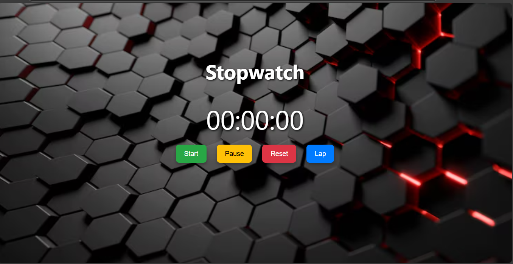

# ⏱️ Stopwatch Web App
A simple and stylish stopwatch built with HTML, CSS, and JavaScript. It includes Start, Pause, Reset, and Lap functionality with a modern UI.

🔥 Features
Clean time display (HH:MM:SS)

- Lap recording

- Responsive design

- Eye-catching background

## 📸 Preview

## 🛠 Tech Stack

- HTML

- CSS

- JavaScript

## 🚀 How to Run

* Clone the repository

* Open stop_watch.html in your browser
